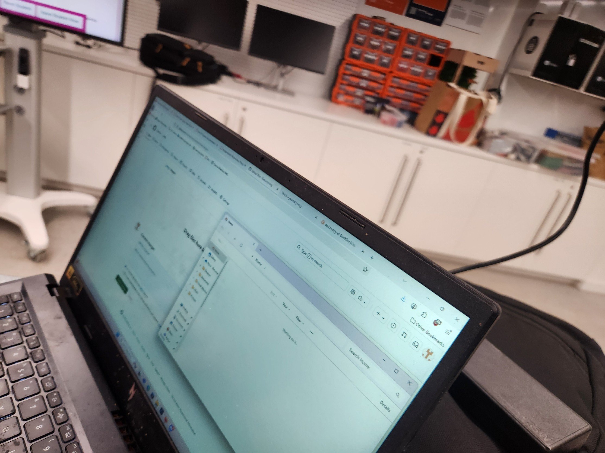
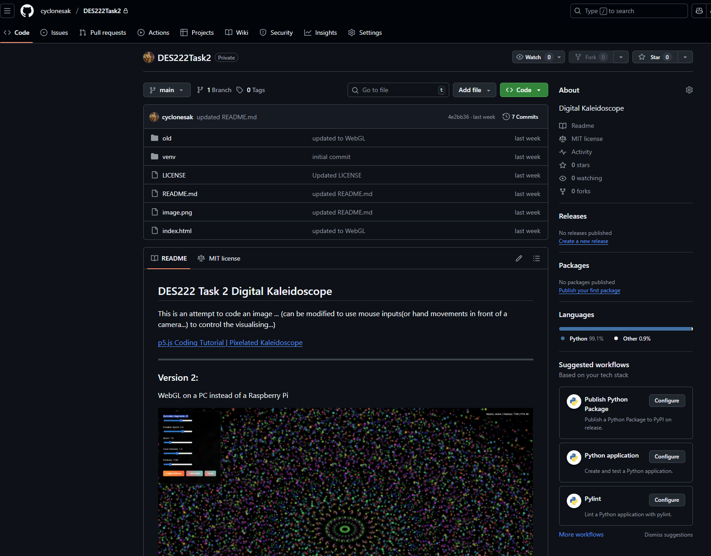

# Process Journal 

initial commit

### Here is me cheating off Bryce's homework :)

***
 Here is a screenshot of the kaleidoscope image taken from my GitHUb repository. The image is responsive but not very satisfiyingly as yet.

 Movements thus far are minimally responsive to mouse movements but the webcam image control needs refinement ...

 